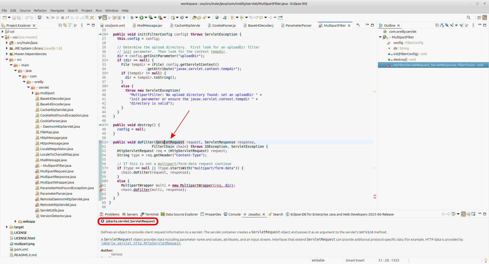

### 2 languages found
[](https://github.com/gbetorre/cos/blob/master/README.md)
[](https://github.com/gbetorre/cos/blob/master/README.it.md)

---


# cos

Porting of a classic utility Java EE API to make it compliance with Servlet 5.0 and Jakarta EE 9+

# History

This library offers several useful tools to facilitate the development of Servlets and related classes.

It was originally released by Jason Hunter (jhunter_AT_servlets.com); later, it was brought to GitHub by [James Zhan](https://github.com/jfinal) ([jfinal](https://github.com/jfinal)), making it also easily integrated into Maven projects via the following dependency:

```XML
    <dependency>
        <groupId>com.jfinal</groupId>
        <artifactId>cos</artifactId>
        <version>2017.5</version>
    </dependency
```

The [jfinal release](https://github.com/jfinal/cos) is very useful for Java developers who find the classes in this library useful but do not want integrating the jar (downloadable from https://www.servlets.com/cos/) directly (for instance, via configuring the Java Build Path) into their project and rather prefer to configure the library in the Maven project descriptor (that is nice and clean to do).

# The problem

Until the Tomcat version 9, so far so good.

You should consider that we are talking about an utility intended to be integrated into web-based applications, which run inside a server, receive requests and provide responses basically through the HTTP protocol.

One of the most widely used servers for this purpose, especially in the development phase, is Apache Tomcat, currently up to version 11.

The problem is that, as also reported in the documentation, starting with version 10:

>  as a result of the move from Java EE to Jakarta EE as part of the transfer of Java EE to the Eclipse Foundation, the primary package for all implemented APIs has changed from javax.* to jakarta.*. This will almost certainly require code changes to enable applications to migrate from Tomcat 9 and earlier to Tomcat 10 and later. 
> A migration tool is available to aid this process.

Which means that, if you do not migrate, applications running under Tomcat 9 will no longer work in Tomcat 10 and later.

Summarizing:
- Since **Tomcat 10**, the Servlet API package has changed from **`javax.servlet.*` to `jakarta.servlet.*`** due to the **Jakarta EE namespace migration**.
    
- **Servlets and classes like `HttpServlet` now live in `jakarta.servlet.http.HttpServlet`**, not `javax.servlet.http.HttpServlet`.
    
- Web apps compiled against the old `javax.servlet` API will fail with `ClassNotFoundException` on Tomcat 10, and later, unless migrated to the new `jakarta.servlet` namespace.

# A solution

In order to make the `cos` library compatible with the new Jakarta EE namespace, the following operations must be performed on the sources:

## Editing of all source files

1. **Changing all imports from:**<br> 
    `import javax.servlet.http.HttpServlet;`<br> 
    to:<br> 
    `import jakarta.servlet.http.HttpServlet;`

 Paying attention to internal dependecies:



***Figure.1 - If there are internal dependencies, and the classes we are calling have not been updated yet, the calling classes - passing the new objects - will generate errors***

> In the example above, the type of the ServletRequest object is already correct; in fact, it references the updated `jakarta.servlet` package instead of `javax.servlet` (as can be seen in the Javadoc below).<br> 
> However, the `MultipartFilter` class still has an error that prevents it from being compiled, because the `MultipartWrapper` class, used by it on line 61, expects a `javax.servlet.ServletRequest` (to be precise, a `javax.servlet.http.HttpServletRequest` which is a specialized interface extending ServletRequest) and not a `jakarta.servlet.ServletRequest` as a parameter, since the MultipartFilter class has been corrected whilst the MultipartWrapper - that is the called class - not yet.

2. **Implementing the inherited abstract method - at first even as stubs - where necessary.**

Jakarta EE 9+ introduced several new abstract methods in existing classes and interfaces that your code must implement.

Because my applications only use a very small subset of the classes offered by the cos library, I did not need to implement the new methods or test the porting work extensively. This approach will remain in the library release after porting is complete.

***SO, CAREFULLY USING STUBS!***<br> 
Implementing the new abstract methods from Jakarta Servlet API classes like ServletInputStream just as stubs (empty or trivial implementations) can be acceptable **as a temporary or minimal fix, but it may create further issues** depending on runtime use and server expectations.

For instance:
1. Non-blocking I/O expectations:
- Methods like isFinished(), isReady(), and setReadListener(ReadListener) in class BufferedServletInputStream are related to asynchronous and non-blocking I/O support introduced in Servlet 3.1+.
- Returning conservative stub values (isFinished()=false and no-op setReadListener) may work in synchronous scenarios.
- If your server or framework uses non-blocking async features, the stubs may cause incorrect behavior, unexpected blocking, or ignored async events.
2. Incorrect or incomplete contract implementation:
- The stub methods do not reflect the real state of the stream.
- This could cause the container or filters to misbehave if they check isFinished() or call back on read listeners.
3. Future compatibility and maintenance:
- As servlet containers evolve, they might rely more on these methods.
- Stub implementation could even work right now but may need revisiting or proper implementation later.

This repository is not a service provided by a company or a paid consultant but only the effort of volunteers to make an old library a little more up-to-date, within the limits of work done out just for passion and offered as a contribution to the developer community.

***Therefore, this software is provided 'AS IS' and I take no responsibility for any problems and incorrect operation caused by the classes modified for this porting.***

___

NOTE: the classes of this repository containing inherited abstract methods implemented as stubs, that **must be checked before using the library in production** and, as necessary, receive reasonable implementation, are the following:

- `src/main/java/com/oreilly/servlet/CacheHttpServlet.java`
- `src/main/java/com/oreilly/servlet/multipart/BufferedServletInputStream.java`
- `src/main/java/com/oreilly/servlet/multipart/LimitedServletInputStream.java`


## Updating the build descriptor

In order to compile the project for Jakarta EE, of course, you must also update Maven (or Gradle) dependencies accordingly to Jakarta EE 9+ versions of the Servlet API:

```XML    
    <dependency> 
        <groupId>jakarta.servlet</groupId> 
        <artifactId>jakarta.servlet-api</artifactId> 
        <version>5.0.0</version> 
        <scope>provided</scope>
    </dependency>
```

and recompile.

The purpose of [this repository](https://github.com/gbetorre/cos) is to do the first step for you, making easier the job of the programmer who likes to use the `cos` library and saving him some time (I have to do this anyway, so I can continue using it in my projects).

# Examples

One of the features of `cos` which is very useful - among the others - is the HttpServletRequest parameters management made by the class 
`com.oreilly.servlet.ParameterParser`:

```JAVA
import com.oreilly.servlet.ParameterParser;
public class ProcessCommand extends ItemBean implements Command {
    public void execute(HttpServletRequest req) {
        ParameterParser parser = new ParameterParser(req);
        String part = parser.getStringParameter("p", "-");
        int idP = parser.getIntParameter("pliv", -1);
        String pliv = parser.getStringParameter("pliv2", "");
        int liv = parser.getIntParameter("liv", -1);
    }
}
```
***List.1 - Sample use of a cos class, ParameterParser***

As you can see, by using the ParameterParser instead of direct retrieval from HttpServletRequest, it becomes possible to assign a default to the value if it is not present in the request.<br> 
This seems trivial but, instead, is very convenient because it saves having to assign defaults in multiple statements, handle exceptions resulting from the presence of null values, and so on.

Another example of the use of this class can be seen in the context of populating structures afferent to the Dictionary:

```JAVA
LinkedHashMap<String, String> struct = new LinkedHashMap<>();
struct.put("liv1",  parser.getStringParameter("sliv1", VOID_STRING));
struct.put("liv2",  parser.getStringParameter("sliv2", VOID_STRING));
struct.put("liv3",  parser.getStringParameter("sliv3", VOID_STRING));
struct.put("liv4",  parser.getStringParameter("sliv4", VOID_STRING));
```
***List.2 - Exaple of ParameterParser use directly in HashMap***

I love Java, but we have to face that it's a programming language that quickly tends to become verbose and boilerplate.
As you can see in the example above, this library object makes Java syntax a little more streamlined than it naturally is...

## About the style

If you will examine carefully the sources of the `cos` repository, you will notice that, comparing to modern standards, the syntax adopted in these classes is now somewhat outdated.

For instance: 
* some deprecated constructors are used (e.g., Boolean(String), Double(String), Float(String)...)
* some objects with outdated implementations are used (e.g. Hashtable instead of HashMap)
* some solutions are used that are now considered obsolete (e.g., accessing elements of a collection in raw mode rather than using generics)

and so on.

It is normal that the potential of modern Java syntax is not exploited here, since, when these classes were written, these features did not yet exist in the language itself. Moreover, at that time many methods and constructors had not yet been deprecated.

Thus, there is no intention here to criticize the writing work done at the time by the author.
Simply, it must be kept in mind that some choices are to be placed in the historical period in which they were made.
Also, I personally do not intend to alter the original work more than that, simply making the library compatible with the modern Servlet API.

## About the project

The purpose of this porting is, in fact, plain and simple, to make this library available for use after the transition of the Tomcat implementation following the transfer of Java EE to the Eclipse Foundation.

Of course, Apache Tomcat provides a migration tool to do this; but, having a ready-made library doesn't have to be so bad, right?

Furthermore, `cos` is just a tool used by a niche of developers and is used to continue to keep the code up and running without having to waste time even making adjustments: God only knows how much time and stress migrations and new project startups entail.

Therefore, I hope that this porting from Java EE to Jakarta EE will be useful for some of us programmers; if so, please consider starring it.

# License

Servlet, see LICENSE.

# Author

* [jhunter](https://www.servlets.com/jason/) 

## Maintainers

* [jfinal](https://github.com/jfinal) 
* [gbetorre](https://github.com/gbetorre)
